# Docling Task

## Introduction

For this task, I worked with the Docling CLI to see how well it can convert PDFs into more usable, structured formats. The goal wasn’t just to run a few commands, but to actually understand how tools like this fit into bigger systems, especially in workflows like Retrieval-Augmented Generation (RAG), where clean and well-structured data really matters.

Most PDFs aren’t exactly easy to work with. They can have multiple columns, images, tables, and all sorts of formatting that make them hard to process programmatically. That’s where Docling comes in, it takes these messy, unstructured documents and converts them into formats like Markdown or HTML that are much easier to read, edit, and feed into AI systems.

In this documentation, I go through the full process, installing Docling, running basic conversions, and then experimenting with different options to see how the outputs change. I didn’t just stick to the default settings, I tried different pipelines, output formats, and flags to compare results and understand the trade-offs.

I also used fairly complex PDFs, not just plain text, so I could really test how well Docling handles things like layout, images, and formatting. Along the way, I point out what worked well, what didn’t, and what I’d realistically use in a real-world scenario.

Overall, this is a hands-on exploration of Docling, what it does, how it behaves under different settings, and how useful it actually is when you’re dealing with real documents.

---

## Installing Docling

- To get started, I installed [**Docling**](https://www.docling.ai/) using Python’s package manager, pip, with **`pip install docling`**. This makes it easy to install and use the CLI directly from the terminal.

> [!NOTE]
If you're on Windows, you might see warnings related to symlinks from the Hugging Face cache. These don’t stop the installation from working, but enabling Developer Mode or running as administrator can remove the warnings.

- After installing Docling, I verified that it was set up correctly by checking the installed version from the command line using the command **`docling --version`**.

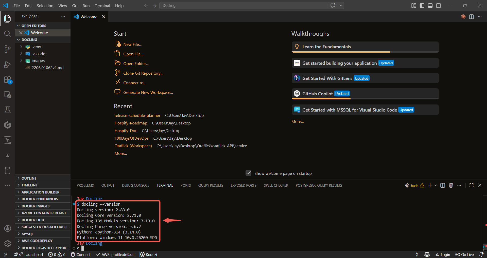

> [!NOTE]
If the command is not recognized, it usually means the installation path is not in your system’s PATH, or the installation did not complete properly.

---

## First Exploration

1. After installing Docling i wasn't sure the exact file to use for my tests, so i started with the proposed [**pdf**](https://events.linuxfoundation.org/wp-content/uploads/2026/03/sponsor_pytconf26_eu_030526.pdf) for this task.

2. I ran the command **`docling https://events.linuxfoundation.org/wp-content/uploads/2026/03/sponsor_pytconf26_eu_030526.pdf`** so docling can process the file, this converts the pdf to markdown format, which is the default. If you want to convert to a specific file type, then you add the **`--to`** flag.

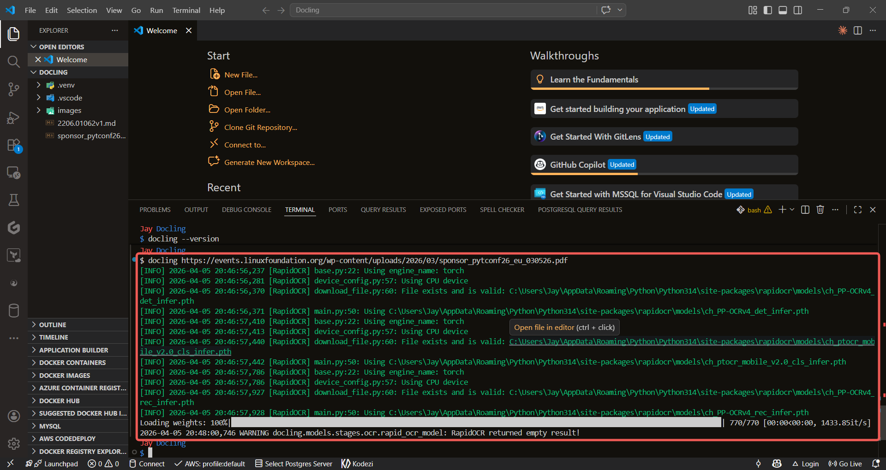

>[!NOTE]
I noticed some messages on screen which i didn't understand, i initially thought it was an error until i did some more research on what i was seeing, and i also noticed the markdown file appear. I'll analyse those messages a bit here.

- **`[INFO] Using engine_name: torch`**
This means Docling is using PyTorch as its underlying engine to run machine learning models, which is expected since components like OCR and the VLM pipeline rely on it to process and interpret document content.

- **`Using CPU device`:**
This indicates that Docling is running on the CPU rather than a GPU, which is completely fine but typically slower, since GPUs are better optimized for running machine learning workloads.

- **`download_file.py: File exists and is valid`**
This message shows that Docling checked for required model files, such as **`ch_PP-OCRv4_det_infer.pth`**, and confirmed they already exist locally; these files are pretrained OCR models that are downloaded during the first run and reused afterward, so there is no need to download them again.

- **`Using ... rapidocr/models/...`**
This means Docling is loading OCR models from the local directory, specifically models responsible for detecting where text appears in the document and then recognizing the actual characters, essentially working in two steps, locating text regions first and then reading the text within them.

- **`Loading weights: 100%`**
This indicates that the model weights have been fully loaded into memory, meaning the system has finished preparing the AI models and is ready to begin processing the document.

- **`RapidOCR returned empty result`**
This means the OCR system attempted to detect text but found none, which usually happens when the PDF already contains embedded, selectable text, so OCR is unnecessary and does not produce any results.

3. Next, I wanted to try converting the PDF to several different formats. I didn't want to go through the process of passing the URL every time, so I downloaded the file.

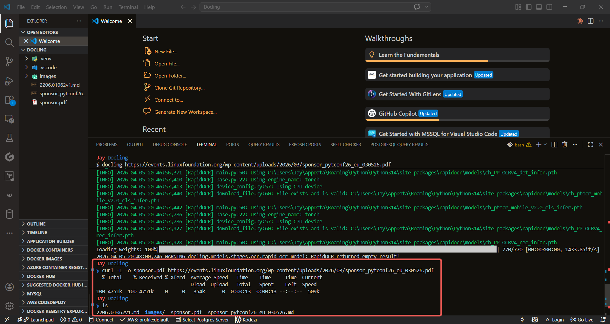

I used the command **`docling sponsor.pdf`** to convert it into Markdown format. Taking a look at the Markdown, I noticed the changes between the original PDF and the Markdown copy.

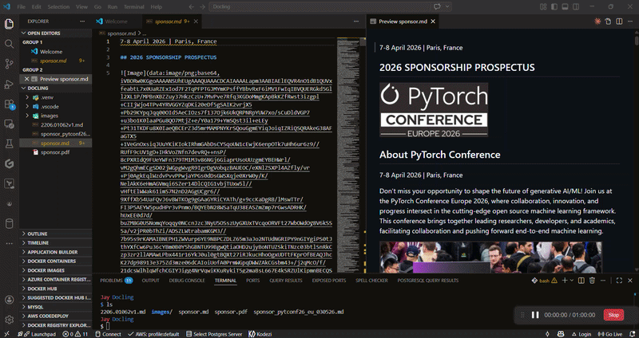

4. Looking through the file, at first i thought the text didn't display properly, i saw countless strings of weird text, until i noticed it was attached to the images and realised during the conversion embedded base64-encoded images directly in the Markdown.

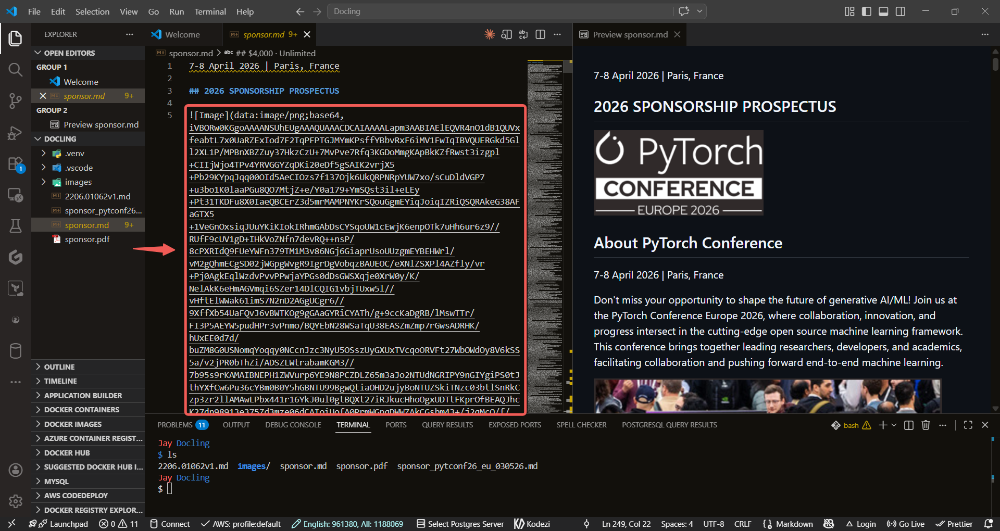

The text was displayed perfectly.

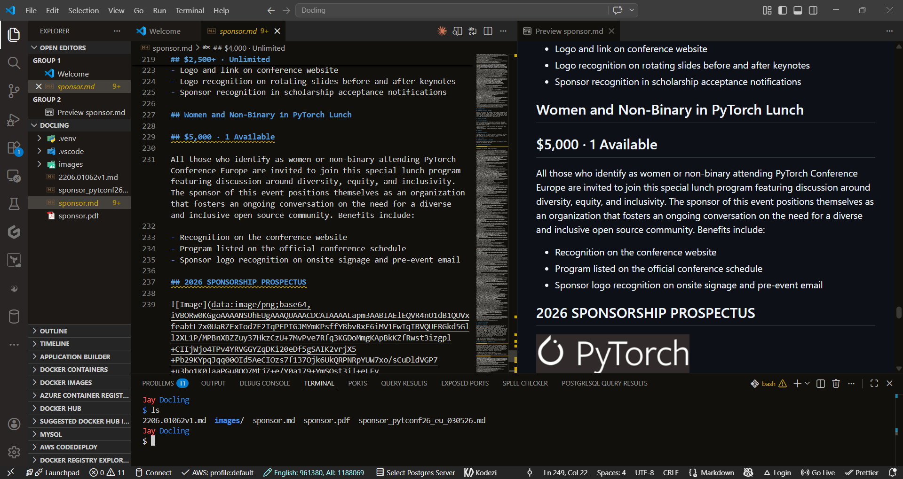

---

### Checking Out Different Outputs

I wanted to convert the pdf to different file formats next, but i wasn't exactly sure on how to do it, so i used the **`docling --help`** command to get information on that.

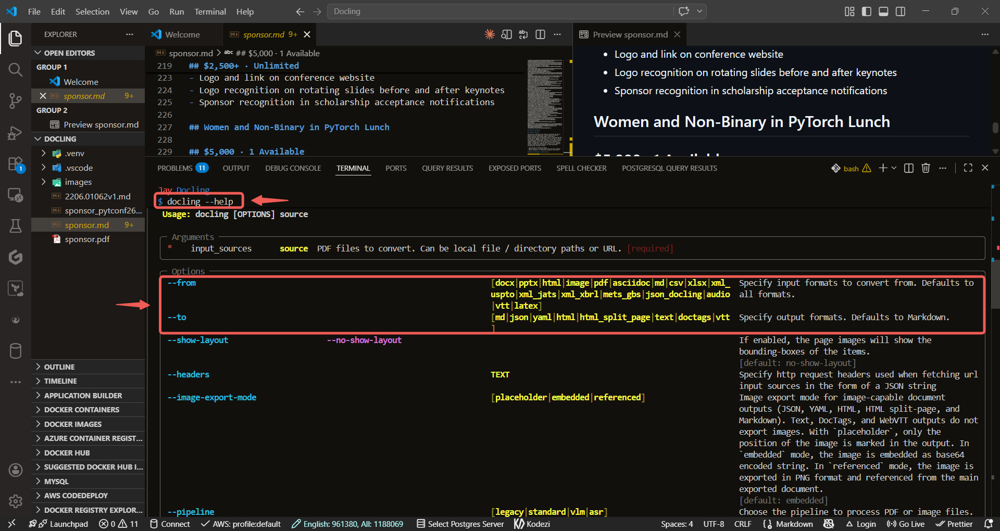

- **Converting to html:** i used the **`docling sponsor.pdf --to html`** command to convert the pdf file to html.

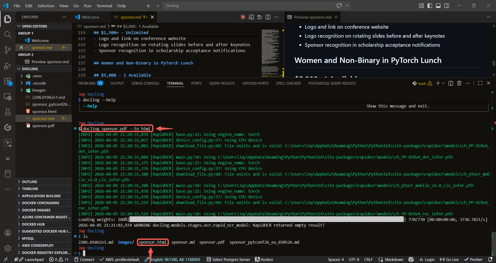

- The **`html`** file was created without any issues. I viewed the file to ensure everything displayed correctly and confirmed there were no problems during the conversion.

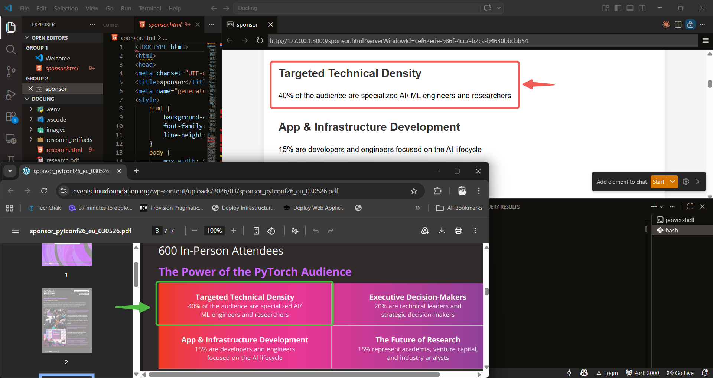

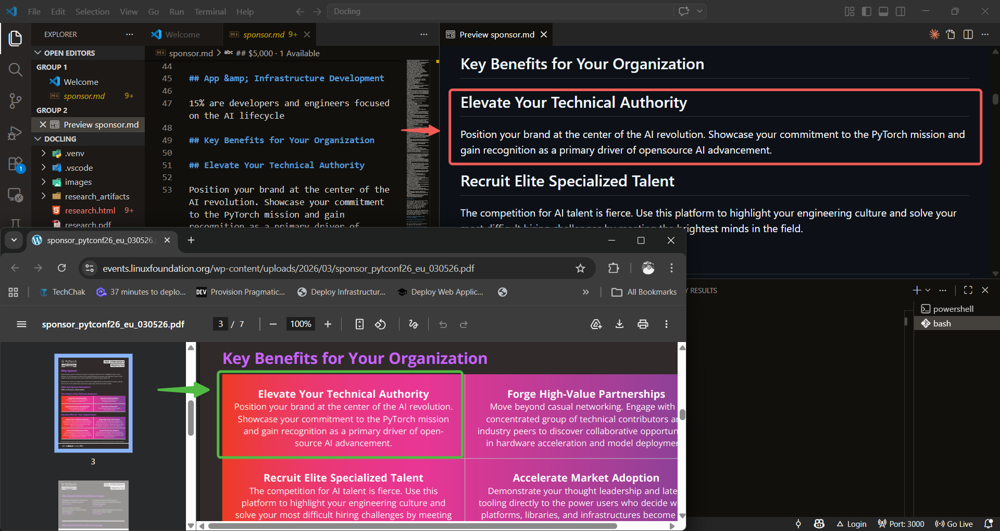

**Something I noticed :** In the original PDF, sections like “Elevate Your Technical Authority” are placed inside coloured boxes with nice styling, things like background colours, gradients, and positioning that make them stand out and easy to notice.
But when Docling converts it to HTML or Markdown, all of that styling disappears. The text itself is still there and correct, it just shows up as plain text without the coloured box or any visual emphasis.

I think this happens because Docling is focused on pulling out the content and structure, not the design. Things like colours, fonts, and layout in a PDF are just visual details, not actual “meaningful” content. So Docling keeps the text and turns it into headings and paragraphs, but drops anything related to styling like those coloured boxes.

---

## Second Exploration

- I decided to try out a different document, an IBM research pdf with more images, tables and complex elements.

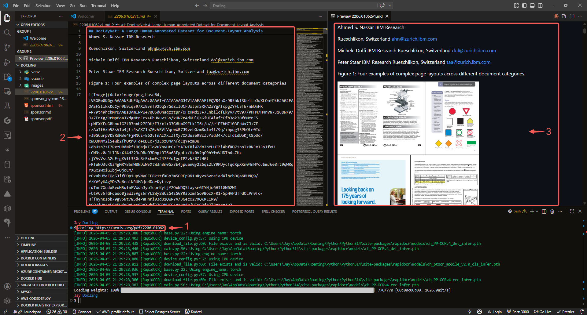

- I wanted to test out multiple outputs of it to, so i downloaded the document and converted it to html.

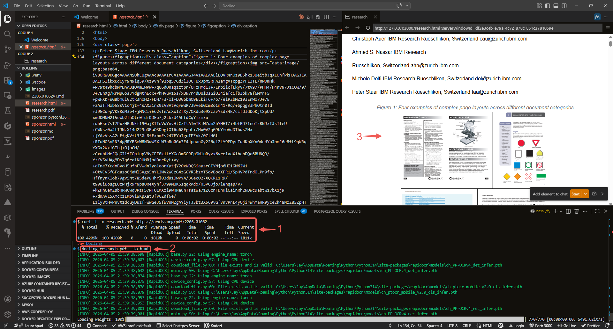

- I wanted to get rid of the base64 encoded image so i added the **`--image-export-mode referenced`** tag and converted to html again.

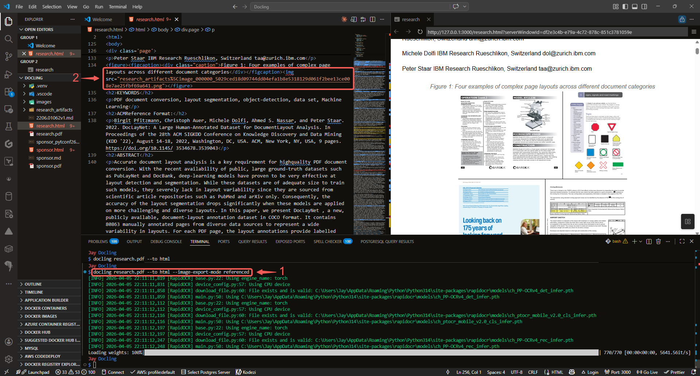

One thing that stands out across all the tested documents is that images carry over perfectly. They aren't corrupted or distorted in any way during the conversion. While the text fonts change and the tables look different, I actually think the tables display better in the new format.

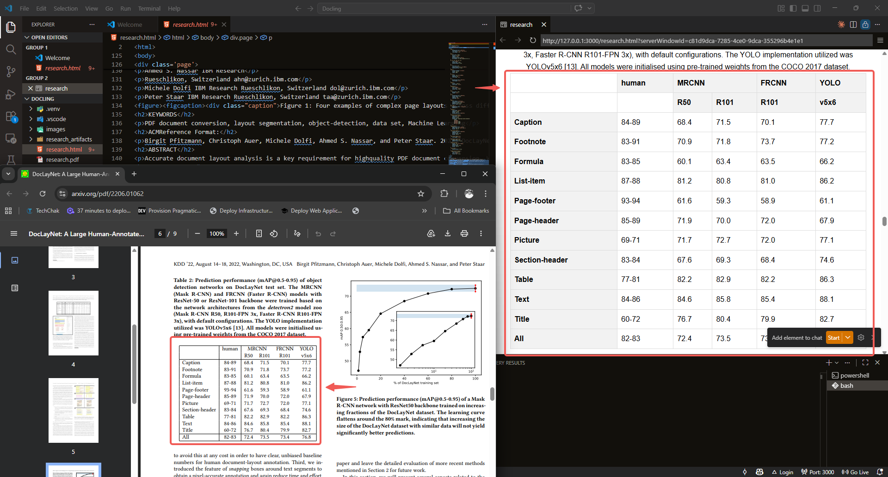

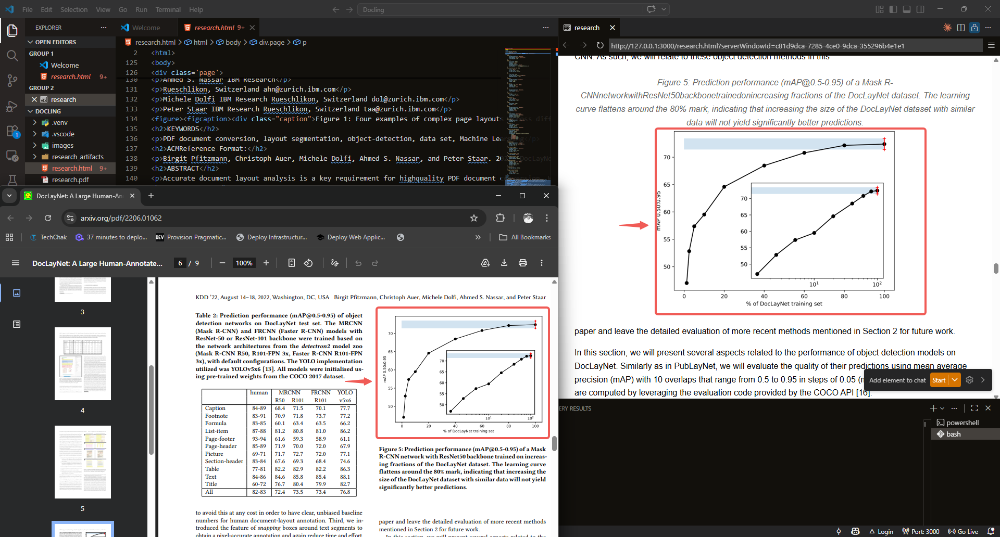

---

## Third - Final Exporation

For my final test i decided to use a pdf of a harvard brochure, it had images, multiple stylings, tables, and various shapes, making it the perfect document to help me reach a final conclusion.

- At first conversion i noticed warnings like **“RapidOCR returned empty result”** and **“The text detection result is empty.”** After further analysis i realised This happened because the page I was processing is mostly made up of images and heavy visual design, not clean, selectable text. From the preview, you can see things like a full-page background image, stylized text, and layered graphics. To us, it looks like normal text, but to the OCR model, it’s closer to an image than structured text.

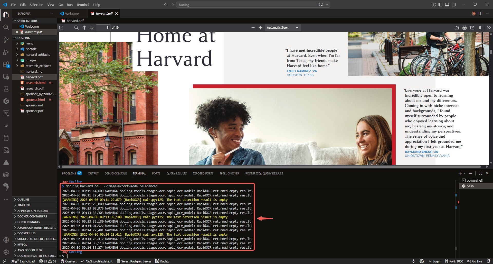

Docling automatically tries to use OCR (Optical Character Recognition) to read text from images. In this case, it used RapidOCR, which first tries to detect where text exists on the page, then tries to read it.

The issue here is that the model couldn’t clearly detect any readable text regions, so it returned an empty result. That’s why the warning shows up. It’s basically saying, “I looked for text in this image, but couldn’t confidently find anything to extract."

> [!NOTE]
nothing is actually “broken” here. It just means OCR wasn’t useful for this particular page, and Docling couldn’t extract text from it using that method.

---

### What I Noticed - Improper Rendering and Text Distortion

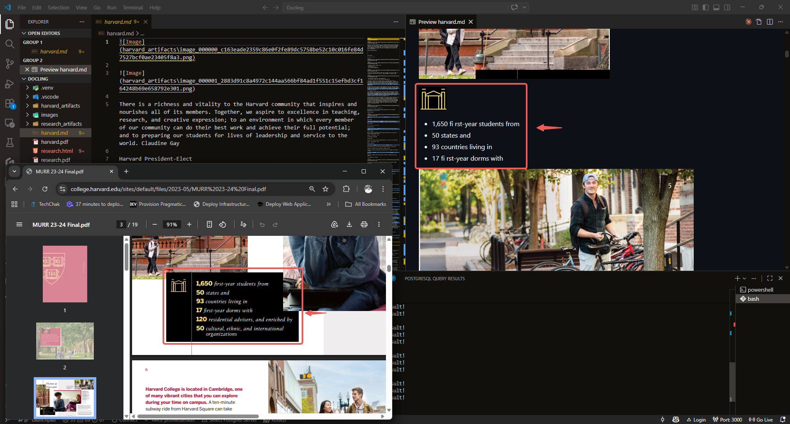

In some sections, the output didn’t just lose styling, it actually broke the structure and readability of the content.

In the original PDF, the text appears inside a clearly defined, styled block with proper alignment and readable formatting. But in the converted output, that same section is distorted. The layout is lost, parts of the text are misaligned, and some words or spacing appear incorrect.

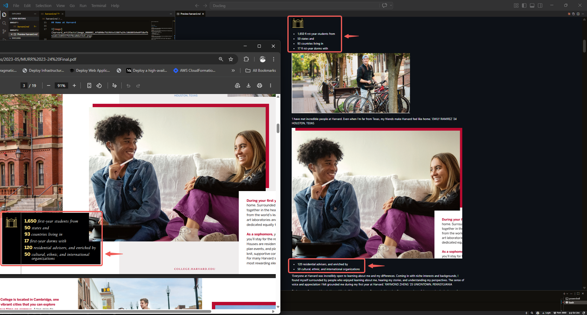

I think this happens because the PDF uses a complex layout, where text is layered on top of images, arranged in columns, or positioned using precise visual placement. Docling tries to interpret the layout and convert it into structured text, but from what I observed, it seems to struggle with getting that layout to translate correctly.

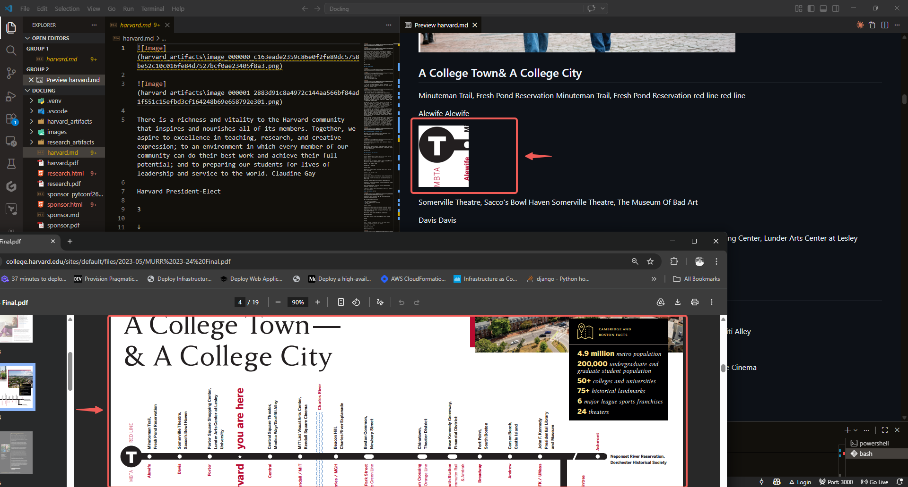

As a result, elements that were visually grouped together in the PDF can get split, reordered, or merged incorrectly. In some cases, the model may even misread parts of the text, especially when fonts are stylised or placed over busy backgrounds.

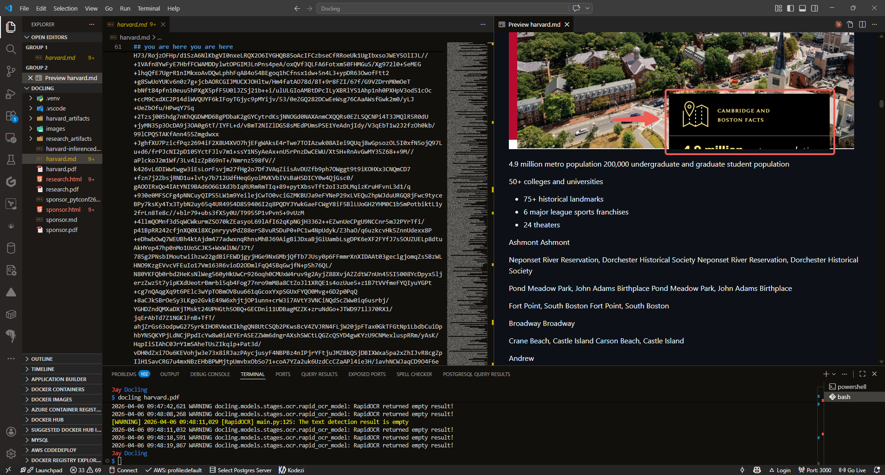

So instead of a clean block of text, you end up with something that looks scrambled or poorly formatted. And the same thing carried over in other formats like html too.

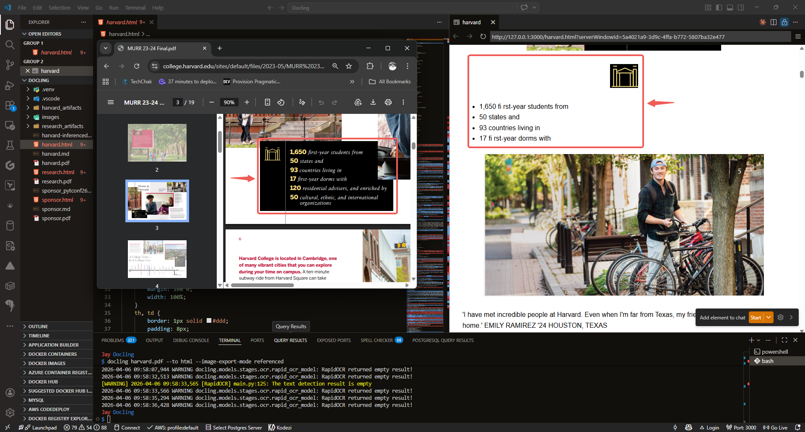

The original PDF treats the page like a fixed canvas, where everything is placed exactly where it should be, including text, shapes, and spacing. The layout itself carries meaning, like how elements are positioned relative to each other, and it can handle things like vertical text and layered graphics without any issues.

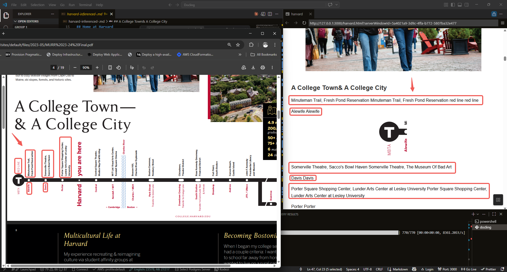

In the converted HTML, everything gets forced into a simple top-to-bottom flow. Because of this, the layout is lost, visuals like the map disappear, and text gets stacked instead of positioned. This also leads to issues like repeated words, misoriented text, and small character errors, making the result look messy and harder to read.

---

For my final test, I tried converting the file to JSON, and my system became unresponsive for a while during the process. This was also the largest file in the set at 73MB, which likely added to the strain. It seems like generating the JSON output is more resource-intensive, likely because it’s trying to capture a lot more detailed structure from the document.

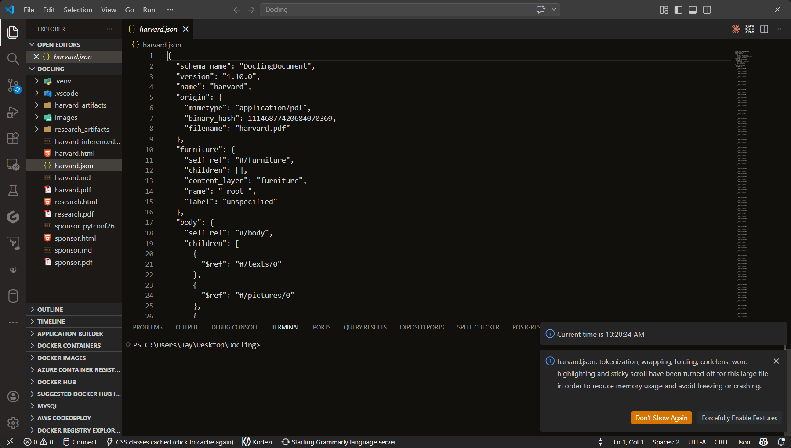

>[!NOTE]
Overall, these experiments showed a clear trade-off: Docling does a good job at extracting text and structure, but anything heavily dependent on visual design, precise layout, or complex formatting tends to get simplified or lost in the conversion process.

---

## Structured Output Test - Files Included In Repo

- **Baseline:** Simple run used as the control test for comparison.

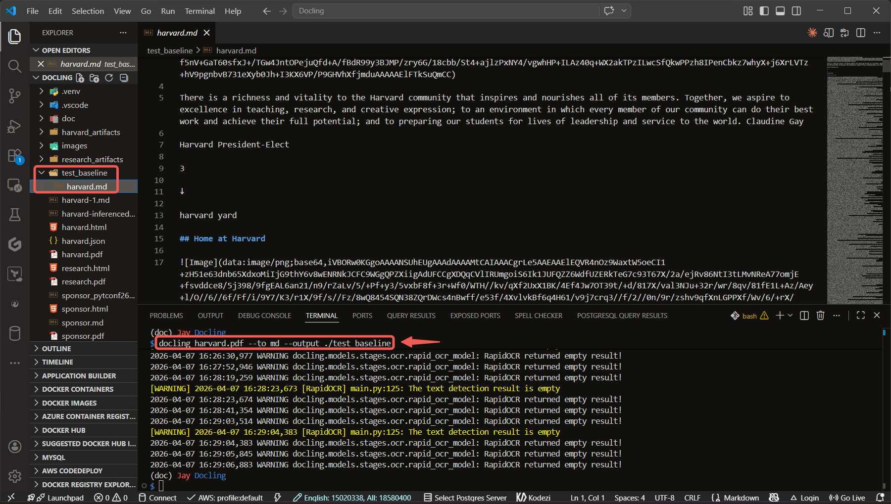

- **Standard Pipeline:** Tested the default pipeline to evaluate improved structure and formatting.

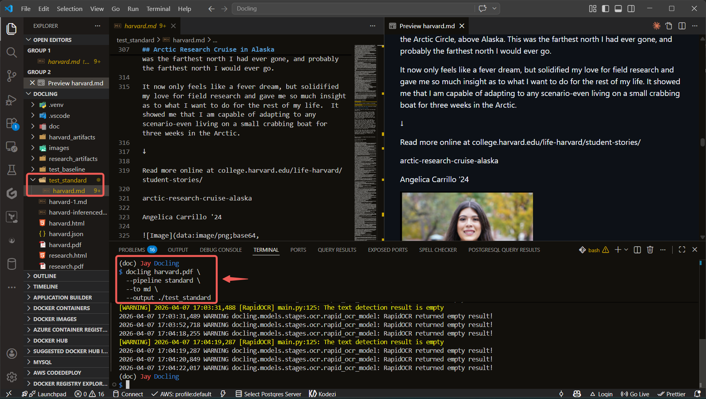

- **VLM Pipeline Test:** This was significantly slower and more resource-intensive than the others, making the system appear unresponsive at times. I initially cancelled it several times before rerunning it in verbose mode, which helped me observe what was happening internally. The delay is expected because Docling’s VLM pipeline uses a Vision-Language Model that processes PDFs page by page, meaning no output is produced until processing completes. This can take several minutes per document, especially on CPU.

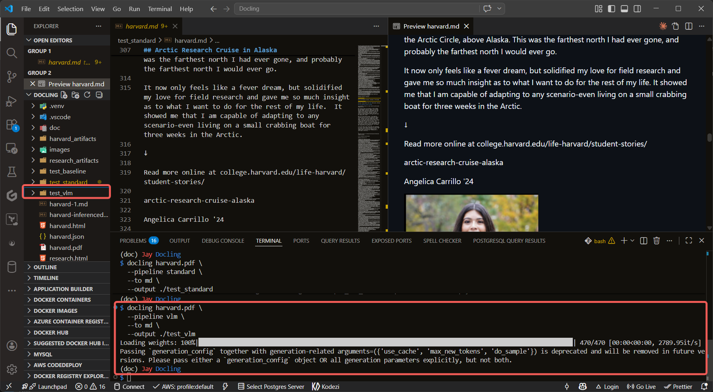

- **HTML Output:** Produced the most readable result, preserving layout and structure more effectively than Markdown.

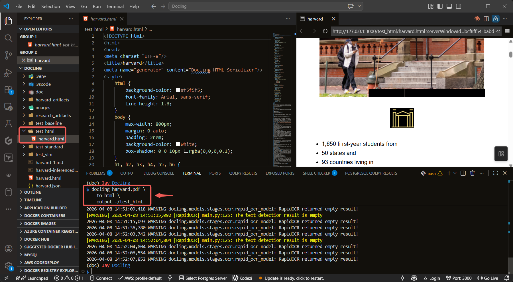

- **Markdown + Separate Images:** Resulted in cleaner formatting with better-organized extracted assets.

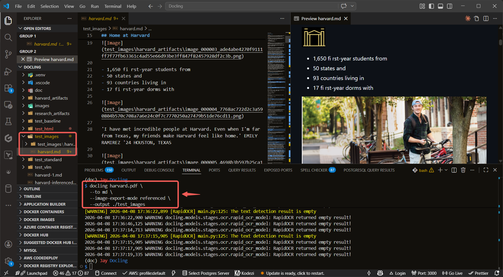

- **OCR Disabled:** Since the PDF (harvard.pdf) didn’t require OCR and the OCR engine struggled to accurately detect text, I tested this mode to check for any differences in output. The results were largely similar, confirming OCR was unnecessary for this document.

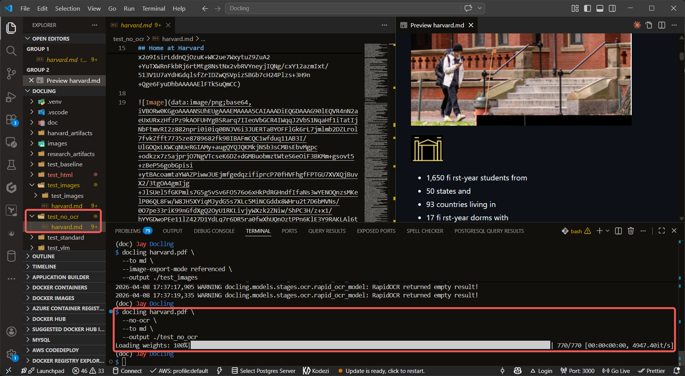

- **Alternative PDF Backend (pypdfium2):** Tested a different conversion backend and observed noticeable improvements in text extraction, particularly in fixing spacing issues.

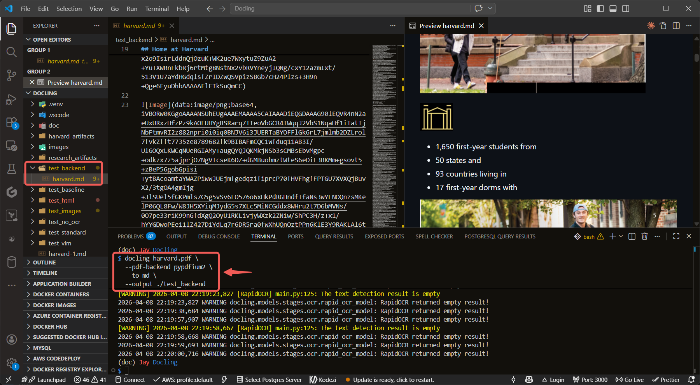

- **Plain Text Output:** Returned only raw extracted text with no formatting or images, minimal and distraction-free. This was also the smallest file, at 28kb.

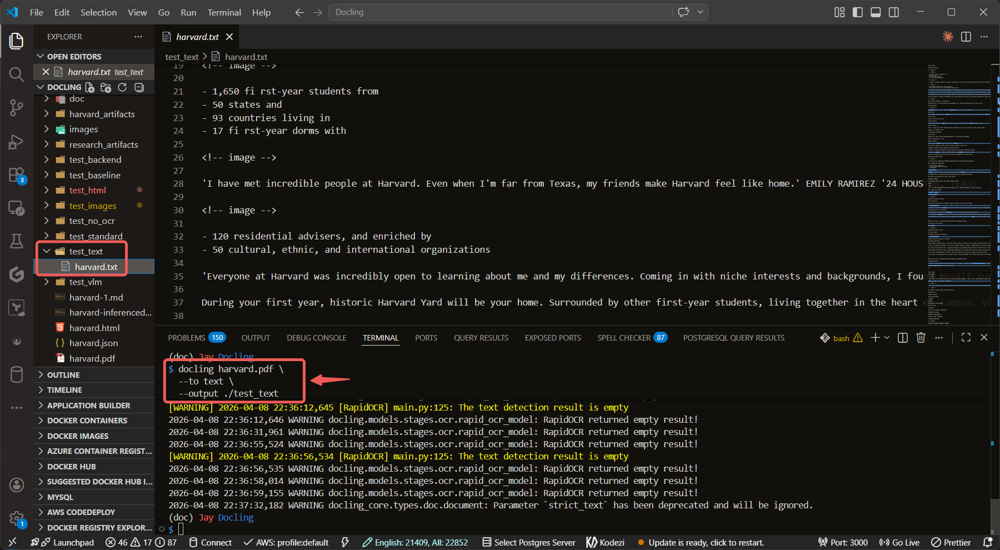

---

## Conclusion

These tests show that different Docling pipelines give very different results in terms of speed, structure, and readability.

The simpler options like baseline, standard, and plain text are fast and lightweight, but you lose formatting and structure. On the other hand, HTML and Markdown with separate images do a much better job of keeping things readable and organized.

The VLM pipeline gives the most detailed processing, but it’s also the slowest by far. It can even feel like the system has frozen, especially on CPU, because it processes the document page by page before showing any output.

I also noticed that turning off OCR and switching PDF backends can improve performance and fix some issues like spacing and messy text extraction, especially when OCR isn’t really needed.

Overall, it’s a trade-off: faster methods are less detailed, while more advanced pipelines give better structure but take much longer. The best choice really depends on whether speed or output quality matters more.
